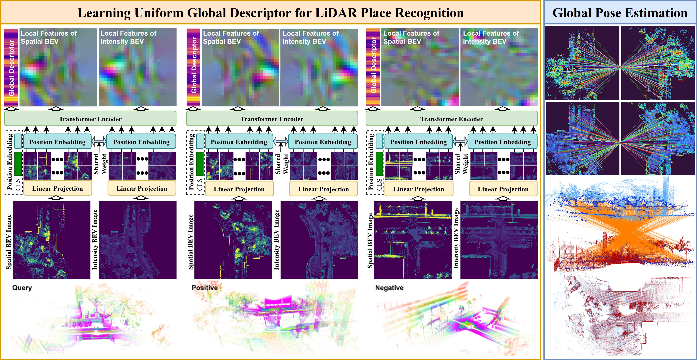

# UniLGL: Learning Uniform Place Recognition for FOV-limited/Panoramic LiDAR Global Localization

<!-- *Remark:* This results is running with single Livox Mid-70. -->
## Applications
UniLGL has been deployed on diverse platforms, including full-size trucks and agile MAVs, to enable high-precision localization and mapping as well as multi-MAV collaborative exploration in port and forest environments, demonstrating the applicability of UniLGL in industrial and field scenarios.

## Additional Information
The code will be released soon. In addition, we will open-source a complete LiDAR-only SLAM system by integrating UniLGL with [CTE-MLO](https://github.com/shenhm516/CTE-MLO), which will be merged into the CTE-MLO repository.